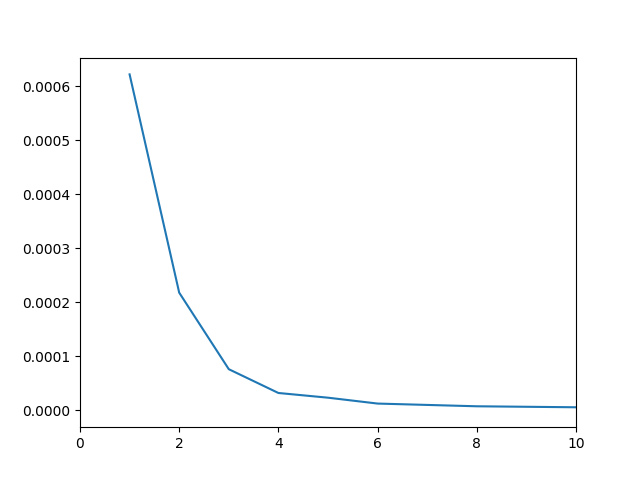
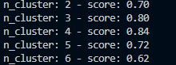
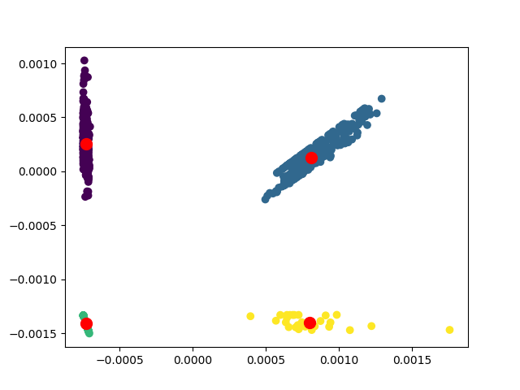
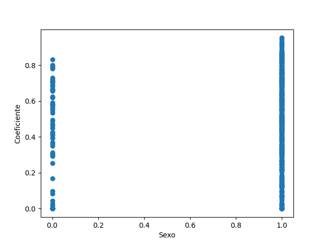
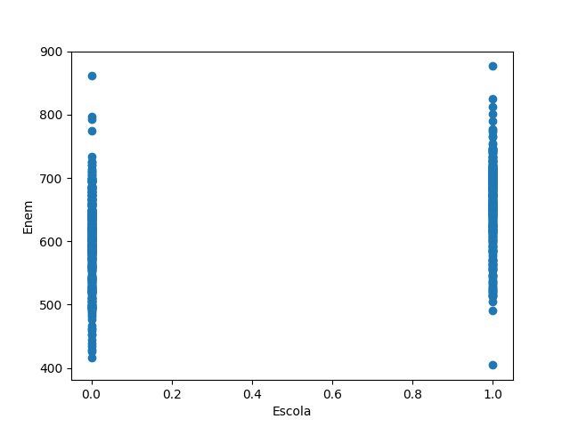
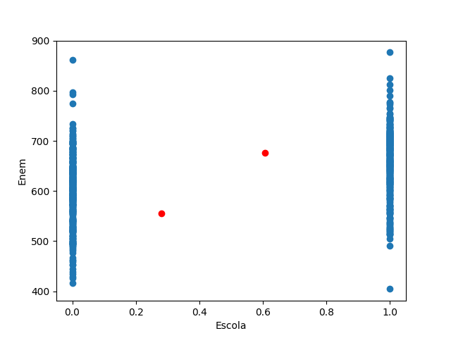

# Aprendizado Não-Supervisionado

**Luiz Fernando da Costa Pereira, RA: 2159660**

### Atividade 1: KMeans utilizando *Elbow Method*

Para obter os resultados, foi utilizado *elbow method*, em conjunto com
os resultados do ``metrics.silhouette_score()``, para cada ``n_cluster``
a fim de ter uma confirmação do melhor valor para K.

Além disso, a fim de ter resultados mais precisos e mostrá-los graficamente,
foi aplicado a diminuição de dimensionalidade por *Principal Component Analysis* (PCA)
reduzindo para 2 dimensões: eixo PCAy e eixo PCAx.

Antes de aplicar o PCA, vale observar que as colunas do arquivo csv tiveram seus valores normalizados.

### Métodos:

Analisando a "curva de cotovelo" gerada a partir de testes para vários valores de *n_clusters*, nota-se que a partir de 4 clusters tem-se um comportamento quase linear.
O cálculo considera a fórmula euclideana para as distâncias das centróides até cada ponto. A partir do momento que as distâncias tendem a zero (sem quedas não-lineares), é possível garantir que as centróides estão em uma distância quase equivalente entre todos
os pontos ao seu redor.

Como meio de confirmação, o melhor *silhouette score* foi encontrado para ``n_clusters = 4`` com 0.84 pontos.

Aplicando **k-means**, com o número de *clusters* encontrado, no gráfico "PCAy X PCAx" tem-se a distribuição das centróides em vermelho:

### Interpretação:

Comparando esses dois parâmetros pode-se apenas inferir que o número de estudantes do sexo masculino (Sexo = 1) é bem maior do que do sexo feminino. O que não é surpresa, considerando que a sociedade atual possui mais homens na área da tecnologia do que mulheres, decorrente de um comportamento cultural histórico de aliar e incentivar desde cedo áreas mais exatas e técnicas do conhecimento aos homens do que às mulheres.

Agora comparando as varáveis Escola e Enem, tem-se outro comportamento esperado considerando a sociedade atual. Em média, as notas mais altas são daqueles que estudaram em escola particular (Escola = 1).

Como forma de demonstração, a figura a seguir mostra o mesmo gráfico mas com um k-médias aplicado considerando ``n_clusters = 2``. Observa-se como as centróides se comportam como uma média entre os valores das notas do Enem para cada tipo de escola, e a da escola particular (coluna x = 1) está maior.

Com isso, tem-se um exemplo claro da desigualdade socioeconômica do país com relação à disparidade entre o desempenho escolar de alunos de escola particular e alunos de escola pública. Tal fato se deve às precariedades enfrentadas no meio público, fora as outras possíveis obrigações que um aluno do ensino médio de escola pública possui além do ambiente escolar.
