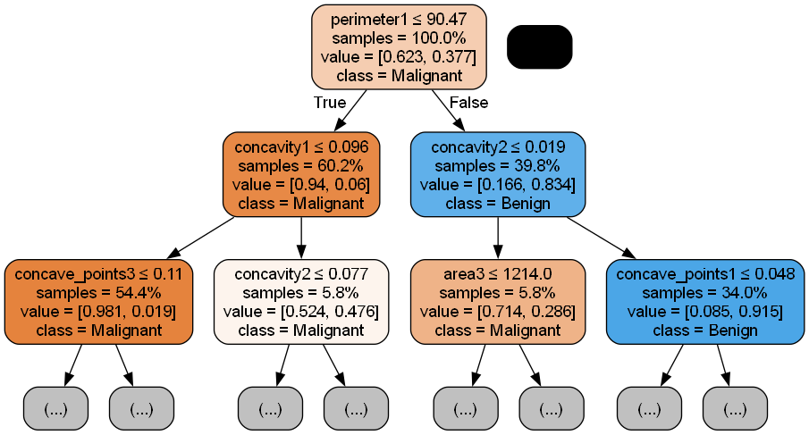
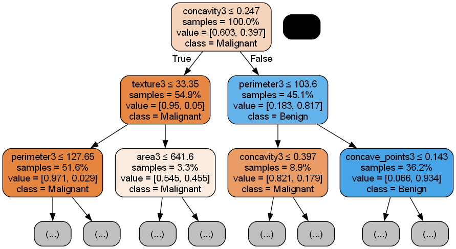
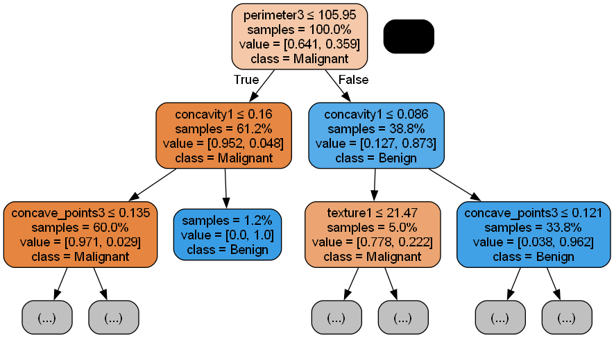

# Aprendizado Supervisionado

O algoritmo escolhido foi o ***Random Forest*** modelado a partir de uma base de dados de diagnósticos de câncer de mama do pacote ```scikit-learn``` [[Documentação](https://archive.ics.uci.edu/dataset/17/breast+cancer+wisconsin+diagnostic)]. O objetivo é classificar se o câncer é Benigno ou Maligno.

O programa ```RandomForest.py``` treina e testa o modelo, além de gerar um diagrama das três primeiras *Decision Trees* (apenas os dois primeiros níveis) por meio do pacote ```graphviz```, e imprime na saída alguns fatores de análise como acurácia, precisão e desvio padrão.

> Por isso deve-se alterar a linha **65** com o caminho da pasta que contém os executáveis do *graphviz*.

### Resultados obtidos

Os últimos resultados obtidos durante o desenvolvimento do algoritmo foram os seguintes:

> Acurácia: 0.970760 => 97.07 %

> Precisão: Benigno -> 0.9814 (98.14 %) -- Maligno -> 0.9523 (95.23 %)

> Revocação: 0.9724 -> (97.24 %)

> Desvio Padrão: 0.0292

E, as três primeiras árvores geradas foram:

##### Arvore 0:


##### Arvore 1:


##### Arvore 2:


As decisões das árvores foram classificadas como Maligno em Laranja (*True*) e o caminho Benigno é de cor Azul (*False*). Em cada nodo mostra a *feature*, as amostras analisadas e a separação delas em cada classe ('M' ou 'B').

### Conclusão

Embora pode-se analisar as árvores acima, ainda não é possível interpretar o modelo de forma geral já que ele conta com 100 árvores (```n_estimator = 100```) e o resultado final é dito pela maioria delas. Entretanto, os parâmetros de análise mostram resultados satisfatórios, condizentes com a acurácia prevista na documentação da base de dados para esse algoritmo.
